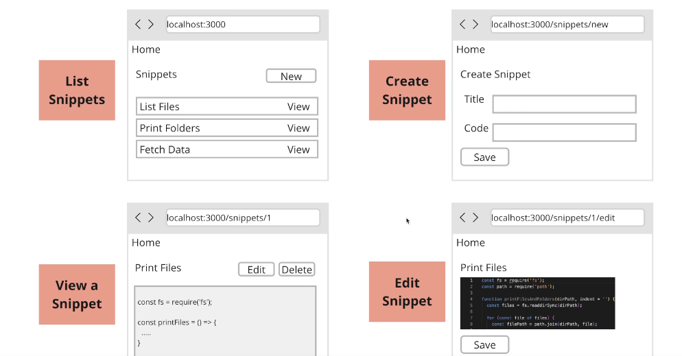
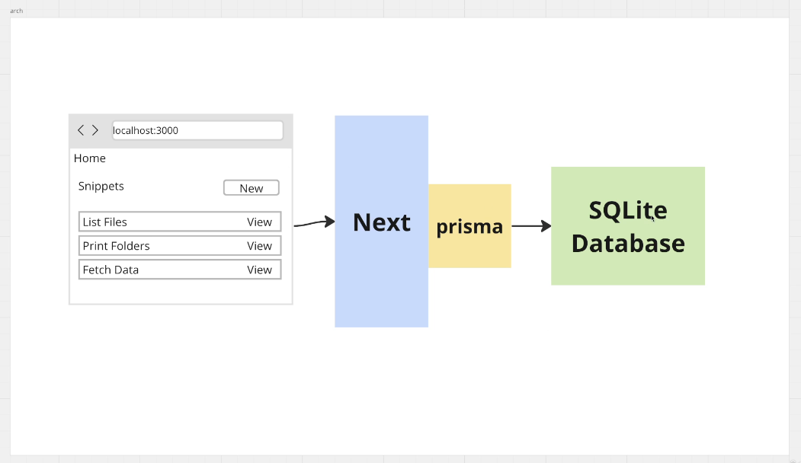
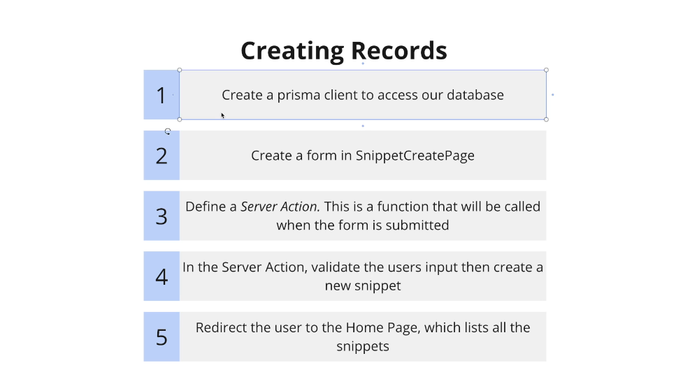

# Section 2 - Changing Data with Mutations

## test urls:
[create snippet](http://localhost:3000/snippets/new)

---

18. App overview



-   Goal - list, create, view, delete snippets
-   note: app router is newer (nextjs13) than pages router

```sh
npx create-next-app@latest
```

```sh
√ What is your project named? ... nextjs-stephen-grider-complete-developers-guide-snippets
√ Would you like to use TypeScript? ...  Yes
√ Would you like to use ESLint? ... Yes
√ Would you like to use Tailwind CSS? ...  Yes
√ Would you like your code inside a `src/` directory? ...  Yes
√ Would you like to use App Router? (recommended) ... Yes
√ Would you like to use Turbopack for `next dev`? ... No
√ Would you like to customize the import alias (`@/*` by default)? ... No
```

19. Project setup

- using sqlite Database



### install prisma
- using prisma to access database
```sh
npm install prisma
```

### setup prisma
- setup prisma to use sqlite
```sh
npx prisma init --datasource-provider sqlite
```

- this creates `prisma/schema.prisma`
- update the schema.prisma file by creating the `model Snippet`

```prisma
// This is your Prisma schema file,
// learn more about it in the docs: https://pris.ly/d/prisma-schema

generator client {
  provider = "prisma-client-js"
}

datasource db {
  provider = "sqlite"
  url      = env("DATABASE_URL")
}

model Snippet {
  id Int @id @default(autoincrement())
  title String
  code String
}
```
### tell db to use model

```sh
npx prisma migrate dev
```

- this creates the db file
- enter a name for migration `add snippets`
- this adds code to project to add, change, view snippets

### creating records


