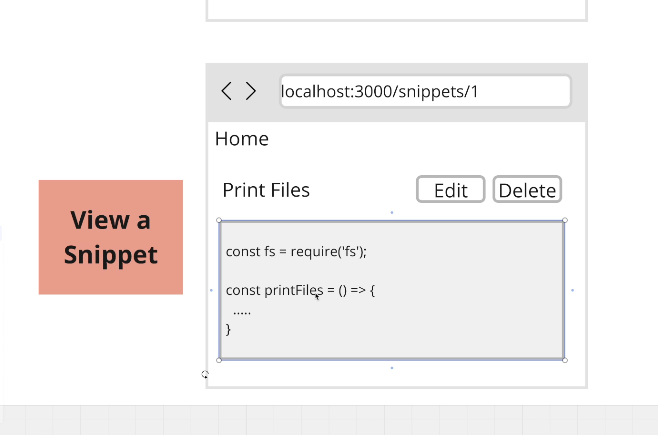

# Section 2 - Changing Data with Mutations

## test urls:

[create snippet](http://localhost:3000/snippets/new)   
[view snippets](http://localhost:3000)  
[edit snippet](http://localhost:3000/snippets/1/edit)  

---

## 18. App overview


- Goal - list, create, view, delete snippets
- note: app router is newer (nextjs13) than pages router

```sh
npx create-next-app@latest
```

```sh
√ What is your project named? ... nextjs-stephen-grider-complete-developers-guide-snippets
√ Would you like to use TypeScript? ...  Yes
√ Would you like to use ESLint? ... Yes
√ Would you like to use Tailwind CSS? ...  Yes
√ Would you like your code inside a `src/` directory? ...  Yes
√ Would you like to use App Router? (recommended) ... Yes
√ Would you like to use Turbopack for `next dev`? ... No
√ Would you like to customize the import alias (`@/*` by default)? ... No
```

## 19. Project setup

- using sqlite Database


### install prisma

- using prisma to access database

```sh
npm install prisma
```

### setup prisma

- setup prisma to use sqlite

```sh
npx prisma init --datasource-provider sqlite
```

- this creates `prisma/schema.prisma`
- update the schema.prisma file by creating the `model Snippet`

```prisma
// This is your Prisma schema file,
// learn more about it in the docs: https://pris.ly/d/prisma-schema

generator client {
  provider = "prisma-client-js"
}

datasource db {
  provider = "sqlite"
  url      = env("DATABASE_URL")
}

model Snippet {
  id Int @id @default(autoincrement())
  title String
  code String
}
```

### tell db to use model

```sh
npx prisma migrate dev
```

- this creates the db file
- enter a name for migration `add snippets`
- this adds code to project to add, change, view snippets

### creating records


## 20. create page

- src/app/snippets/new/page.tsx

## 21. creating a prisma client within nextjs

```ts
//src/db/index.ts

import { PrismaClient } from "@prisma/client";

export const db = new PrismaClient();

//create a snippet
db.snippet.create({
  data: {
    title: "title",
    code: "const abc = ()=>{}",
  },
});
```

## 22. adding a creation form

- the default behavior of a form is to send this to the url with names of form as keys

```tsx
//src/app/snippets/new/page.tsx

export default function SnippetCreatePage() {
  return (
    <form>
      <h3 className="font-bold m-3">Create a Snippet</h3>
      <div className="flex flex-col gap-4">
        <div className="flex gap-4">
          <label className="w-12" htmlFor="title">
            Title
          </label>
          <input
            name="title"
            className="border rounded p-2 w-full"
            id="title"
          />
        </div>

        <div className="flex gap-4">
          <label className="w-12" htmlFor="code">
            Code
          </label>
          <textarea
            name="code"
            className="border rounded p-2 w-full"
            id="code"
          />
        </div>

        <button type="submit" className="rounded p-2 bg-blue-200">
          Create
        </button>
      </div>
    </form>
  );
}
```

---

### Section 03 - streaming content with react server components

## 23. intrducing server actions in nextjs

- Define a server action
- this is a function that will be called when the form is submitted
- way to change data in next app
- close integration with HTML forms
- server actions are function that will be called with the values a user entered into a form

## server action

### create server action

- TODO: create server action to change some code in app.
- define `use server` at top of function
- the server action function receives a formData prop of type FormData
- get data off form, eg. `title` is of type `FormDataEntryValue` which is type for what typescript assumes can be a file or string
- we can use `redirect('/')` from 'next/navigation';

```ts
import { db } from "@/db";
import { redirect } from "next/navigation";

async function createSnippet(formData: FormData) {
  //this needs to be a server action!
  "use server";

  //check the users inputs and make sure they're valid
  const title = formData.get("title") as string;
  const code = formData.get("code") as string;

  //check a new record in the database
  const snippet = await db.snippet.create({
    data: {
      title,
      code,
    },
  });

  //redirect user back to the root route
  redirect("/");
}

export default function SnippetCreatePage() {
  return <form action={createSnippet}>//...</form>;
}
```

## 25. server components vs client components

## server vs client component

### client component

- client component -> can use hooks
- to define a client component
- cannot import server components directly
- use when you need to use hooks
- use when you need to use event handlers

```jsx
"use client";
```

### server component

- server component -> cant use hooks
- server component -> cant assign event handlers (eg. no onClick)

  - use as much as possible
  - by default everything is server components
  - can use async await syntax directly in body of component

## 26. fetching data with server components

- fetching data


- from server component, have direct access to db (unless using 3rd party api)
  - just import prisma client to access db

```tsx
//app/page.tsx

import { db } from "@/db";

export default async function Home() {
  const snippets = await db.snippet.findMany();
  const renderedSnippets = snippets.map((snippet) => {
    return <div key={snippet.id}>{snippet.title}</div>;
  });

  return <div>{renderedSnippets}</div>;
}
```

## 27. adding dynamic paths

- ability to view a snippet


- use id from url to show dynamic content
- http://localhost:3000/snippets/1


## 28. async dynamic params in nextjs 15

- in nextjs 15 - we must await params or searchParams before accessing

```ts
const { id } = await props.params;

const snippet = await db.snippet.findFirst({
  where: { id: parseInt(id) },
});
```

- update the Interface and wrap the params in a Promise:

```ts
interface SnippetShowPageProps {
  params: Promise<{
    id: string;
  }>;
}
```

## 29. fetching particular records

- to pull a particular record from database, use `db.snippet.findFirst()`
- if data doesnt exist use `import {notFound} from 'next/navigation';`
  - this redirects to not found page

```tsx
//app/snippets/[id].tsx
import { db } from "@/db";
import { notFound } from "next/navigation";

interface SnippetShowPageProps {
  params: Promise<{
    id: string;
  }>;
}

export default async function SnippetShowPage(props: SnippetShowPageProps) {
  const { id } = await props.params;
  const snippet = await db.snippet.findFirst({
    where: {
      id: parseInt(id),
    },
  });

  if (!snippet) {
    return notFound();
  }

  return <div>{snippet.title}</div>;
}
```

## 30. custom not found page

### special app/ folder files

- page.tsx
- layout.tsx
- not-found.tsx
- loading.tsx
- error.tsx
- route.tsx


### notfound
- call `notFound()`
- tries to find closest `/not-found.tsx` or in the closest parent
 
```tsx
//app/snippets/[id]/page.tsx
export default async function SnippetShowPage(props:SnippetShowPageProps){
    const {id} = await props.params;
    const snippet = await db.snippet.findFirst({
        where: {
            id: parseInt(id)
        }
    })

    if(!snippet){
        return notFound();
    }

    return <div>{snippet.title}</div>
}
```

```tsx
//app/snippets/[id]/not-found.tsx
export default function SnippetNotFound() {
  return (
    <div>
		<h1 className="text-xl bold">
			Sorry, but we couldnt find that particular snippet
		</h1>
    </div>
  );
}
```

## 31. Automatic Loading Spinnners
- app/loading.tsx
- displayed whenever server component is fetching some data
- test by making sure an item exists in db (or create one http://localhost:3000/snippets/create) 
- then visit http://localhost:3000/snippets/1

```tsx
//app/snippets/[id]/loading.tsx
export default function SnippetLoadingPage(){
    return <div>loading...</div>
}
```

## 32. view snippets list
- add links to go to view snippet page
- add links to go to create snippet page


- import Link `import Link from "next/link";`

```tsx
//app/page.tsx
import Link from "next/link";
import { db } from "@/db";

export default async function Home() {
  const snippets = await db.snippet.findMany();
  const renderedSnippets = snippets.map((snippet)=>{
    return (
      <Link href={`/snippets/${snippet.id}`} key={snippet.id} className="flex justify-between items-center p-2 border rounded">
        <div>{snippet.title}</div>
        <div>view</div>
      </Link>
    )
  });

  return (
    <div>
      <div className="flex m-2 justify-between items-center">
        <h1 className="text-xl font-bold">Snippets</h1>
        <Link href="/snippets/new" className="border p-2 rounded">new</Link>
      </div>
      <div className="flex flex-col gap-2">
      {renderedSnippets}  
      </div>
    </div>
  )
}
```

## 33. styling the show page (snippet detail page)
- `app/snippets/[id]/page.tsx`

- show title, edit button, delete button



```tsx
//app/snippets/[id]/page.tsx
//...

return (
<div>
	<div className="flex m-4 justify-between items-center">
		<h1 className="text-xl font-bold">{snippet.title}</h1>
		<div className="flex gap-4">
			<button className="p-2 border rounded">Edit</button>
			<button className="p-2 border rounded">Delete</button>
		</div>
	</div>
	<pre className="p-3 border rounded bg-gray-200 border-gray-200">
		<code>
			{snippet.code}
		</code>
	</pre>
</div>
);
```

## 34. linking to the edit page


- `app/snippets/[id]/edit/page.tsx`
- TODO: accessing the wildcard from the url
- you receive this wildcard as a prop
- TODO: hook up edit button to take you to edit page -> http://localhost:3000/snippets/1/edit

```tsx
import Link from 'next/link';
//...

<Link href={`/snippets/${snippet.id}/edit`} className="p-2 border rounded">Edit</Link>
```

## 35. More Async Dynamic Params In Next.js 15
- [docs](https://nextjs.org/docs/messages/sync-dynamic-apis)
- we must await params or searchParams before accessing
- corrected code

```jsx
  const { id } = await props.params;
 
  const snippetId = parseInt(id);
  const snippet = await db.snippet.findFirst({
    where: { id: snippetId },
  });

```
- we need to update the Interface and wrap the params in a Promise

```jsx
interface SnippetEditPageProps {
  params: Promise<{
    id: string;
  }>;
}
```

## 36. Showing a Client Component in a Server Component 


- TODO: fetch data
- TODO: update data
- TODO: show code editor

### react editor
- React Monaco editor


- the idea is we still have a server component
- server component (SnippetEditPage) passes down the code snippet into a client component (SnippetEditForm)


- src/components/snippet-edit-form.tsx
- the type for our SnippetEditFormProps we get from prisma library. 
- Prisma defines interfaces of records in db

```tsx
"use client";

import type {Snippet} from '@prisma/client';

interface SnippetEditFormProps{
    snippet:Snippet
}

export default function SnippetEditForm({snippet}:SnippetEditFormProps){
	return (
		<div>
			Client component has snippet with title {snippet.title}
		</div>
	)
}
```

```tsx
//app/snippets/[id]/edit/page.tsx

import SnippetEditForm from "@/components/snippet-edit-form";

//...
return (
	<SnippetEditForm snippet={snippet}/>
)

```

## 37. installing monaco editor
- Next.js 15 now makes use of React v19 by default
- `npm install @monaco-editor/react --legacy-peer-deps`

## 38. Adding the Monaco Editor
- components/snippet-edit-form.tsx

## 39. Handling Editor Changes
- to handle changes add onChange() handler

```tsx
//components/snippet-edit-form.tsx
"use client";

import type {Snippet} from '@prisma/client';
import Editor from '@monaco-editor/react';
import {useState} from 'react';

interface SnippetEditFormProps{
    snippet:Snippet
}

export default function SnippetEditForm({snippet}:SnippetEditFormProps){
	const [code, setCode] = useState(snippet.code);

	const handleEditorChange = (value: string='') => {
		console.log(value);
		setCode(value);
	}

    return (<div>
        <Editor 
            height="40vh"
            theme="vs-dark"
            language="javascript"
            defaultValue={snippet.code}
			options={{
				minimap: {enabled: false}
			}}
			onChange={handleEditorChange}
        />
    </div>)
}

```

---
# Section 04 - Server actions in great detail

## 40. Server Actions in Nextjs Client Components
- reminder - to define a server action, at top of `async` function use `use server`
- NOTE: you cant `DEFINE` server functions in client components

```tsx
// ERROR -> example defining server function inside client component
async function editSnippet(){
	'use server';
}
```


- FIX: 

### OPTION 1 - define server action in parent component and pass as prop
- NOTE: server component cant pass down event handlers to client components (so this option is not good)
- pass them down through props from a server component 


## 41. server actions in a separate file

### OPTION 2 - export them from a separate file with 'use server' at the top
- define a separate file and define server action (or multiple) and export it


- create our server action in external file `src/actions/index.ts`

```tsx
//src/actions/index.ts
'use server'

import { db } from "@/db";

export async function editSnippet(){
    console.log('edit snippet called')
}
```

```tsx
//src/componets/snippet-edit-form.tsx
import { editSnippet } from '@/actions';

```
## 42. Options for Calling Server Actions from Client Components
- have a button that calls server action

### option 1 - (chosen method) use bind to bind import 
- bind data from state (instead of from form)

```tsx
import * as actions from 'actions';
const [code, setCode] = useState(''); 
const editSnippetAction = actions.editSnippet.bind(null, code)
```


### option2 using startTransition()


- startTransition() ensures our data has been updated before we navigate

```tsx
import * as actions from 'actions';

const handleClick = ()=>{
	startTransition(async()=>{
		await actions.editSnippet(code);
	});
}

//...
return <button onClick={handleClick}>

```

## 43. calling a server action from a Client Component
- try edit a snippet then save.

```tsx
//src/components/snippet-edit-form.tsx
"use client";

import {useState} from 'react';
import type {Snippet} from '@prisma/client';
import Editor from '@monaco-editor/react';
import * as actions from '@/actions';

interface SnippetEditFormProps{
    snippet:Snippet
}

export default function SnippetEditForm({snippet}:SnippetEditFormProps){
	const [code, setCode] = useState(snippet.code);
 
    const handleEditorChange = (value: string='') => {
		console.log('value: ', value);
		setCode(value);
	}

    const editSnippetAction = actions.editSnippet.bind(null, snippet.id, code);

    return (<div>
        <Editor 
            height="40vh"
            theme="vs-dark"
            language="javascript"
            defaultValue={snippet.code}
			options={{
				minimap: {enabled: false}
			}}
			onChange={handleEditorChange}
        />
        <form action={editSnippetAction}>
            <button type="submit" className="p-2 border rounded">Save</button>
        </form>
    </div>)
}

```


```tsx
//src/actions/index.tsx
'use server'

import { db } from "@/db";
import { redirect } from "next/navigation";

export async function editSnippet(id:number, code:string){
    await db.snippet.update({
        where:{id},
        data: {code}
    });

    redirect(`/snippets/${id}`);
}
```

## 44. deleting a record with a server action
- create server action `src/actions/index.ts`
- wrap the delete button with form and action `deleteSnippetAction` 
- deleteSnippetAction binds to the action and passes the `snippet.id`

```tsx
//actions/index.ts

export async function deleteSnippet(id:number){
    await db.snippet.delete({
        where: {
            id
        }
    })

    redirect(`/`);
}
```

```tsx
//app/snippets/[id]/page
import * as actions from '@/actions';

//...
    const deleteSnippetAction = actions.deleteSnippet.bind(null, snippet.id);
	return (
		<div>
			<div className="flex m-4 justify-between items-center">
				<h1 className="text-xl font-bold">{snippet.title}</h1>
				<div className="flex gap-4">
					<Link href={`/snippets/${snippet.id}/edit`} className="p-2 border rounded">Edit</Link>
					<form action={deleteSnippetAction}>
						<button className="p-2 border rounded">Delete</button>
					</form>
				</div>
			</div>
			<pre className="p-3 border rounded bg-gray-200 border-gray-200">
				<code>
					{snippet.code}
				</code>
			</pre>
		</div>
    );	
```
---
# Section 05 - Server Forms with UseFormState Hook
- problem -> empty snippet
- TODO: add validation

## 45. understanding the UseFormState hook
- server forms
- we are trying to run a server action then communicate from server action back to a page
- React-dom (NOT react) contains a hook called 'useFormState' specifically for this
- NOTE: client component renders first on server
- NOTE: if we use the hook the page component must be a client component
- a form State object is now sent with the FormData, and if there are errors on server, the FormState gets updated with an error message and just needs to return FormState.
- the page component will re-render and will have access to the formState message

## 46. useActionState in Next v15
### next15 -> Change the import from this:
```tsx
import { useFormState } from 'react-dom';
```
to this:
```tsx
import { useActionState } from "react";
```

### next15 -> Change the hook name from this:
```tsx
const [formState, action] = useFormState(actions.createSnippet, {;
```

to this:
```tsx
  const [formState, action] = useActionState(actions.createSnippet, {
```

## 47. useFormState (next15 useActionState)
- `app/snippets/new/page.tsx`
- cut createSnippet from client component (app/snippets/new/page.tsx) and put in `src/actions/index.ts`
- the validation message will only show to user after they submit the first time (after server action executes)

```ts
//src/actions/index.ts
export async function createSnippet(formState:{message:string}, formData:FormData){
	//...
	return {
        message: 'Title must be longer'
    }
}
```

- NOTE: useActionState() the first prop is the server action to call, second is the initial state
- returns array [formState, action] second element in array is updated server action with additional functionality
- this second array element (action) is what gets passed to form action
- make use of formState eg. log formState.message
- NOTE: need to mark client component with 'use client';

```tsx
//app/snippets/new/page.tsx
'use client';

const [formState, action] = useActionState(actions.createSnippet, {message:''});

    return (
      <form action={action}>

		//...
		<div>
			{formState.message}
		</div>
	  </form>
//...

```

## 48. Breaking Changes in Forms with React 19
- import the startTransition hook
`import { useActionState, startTransition } from "react";`

- Create a handleSubmit function
```tsx
//app/snippets/new/page.tsx
function handleSubmit(event: React.FormEvent<HTMLFormElement>) {
    event.preventDefault();
    const formData = new FormData(event.currentTarget);
    startTransition(() => {
      action(formData);
    });
  }

```

- Pass the new handleSubmit function to the onSubmit prop to opt out of the form reset

<form onSubmit={handleSubmit}>

## 49. adding the form validation
- src/actions/index.tsx
- return message if validation fails

```tsx
export async function createSnippet(formState:{message:string}, formData:FormData){
    //check the users inputs and make sure they're valid
    const title = formData.get('title');
    const code = formData.get('code');

    //validation
    if(typeof title !=='string' || title.length < 3)
    {
        return {
            message: 'Title must be longer'
        }
    }
    if(typeof code !=='string' || code.length < 10)
    {
        return {
            message: 'Code must be longer'
        }
    }
   
        


    //check a new record in the database
    const snippet = await db.snippet.create({
      data:{
        title,
        code
      }
    });
  
    //redirect user back to the root route
    redirect('/');

  }
  
```

- then in `app/snippets/new/page.tsx`

```tsx
//app/snippets/new/page.tsx
//...

{formState.message ? <div className="my-2 p-2 bg-red-200 border rounded border-red-400">{formState.message}</div> : null}
```